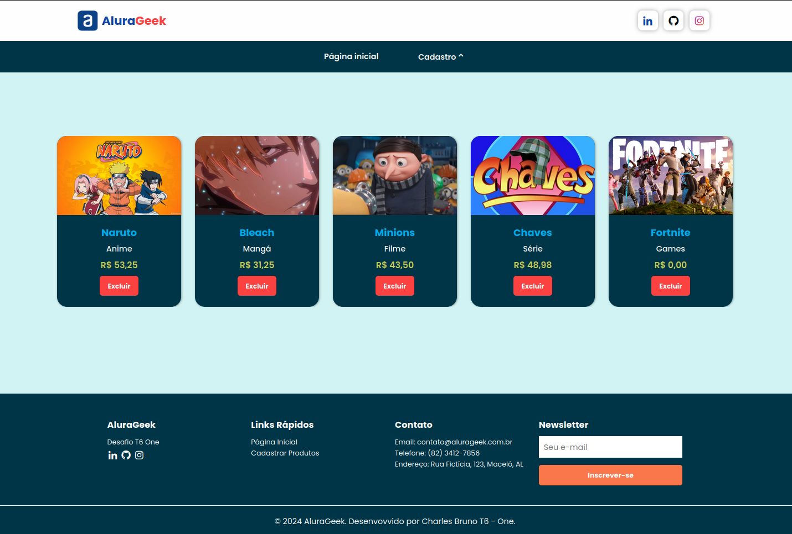
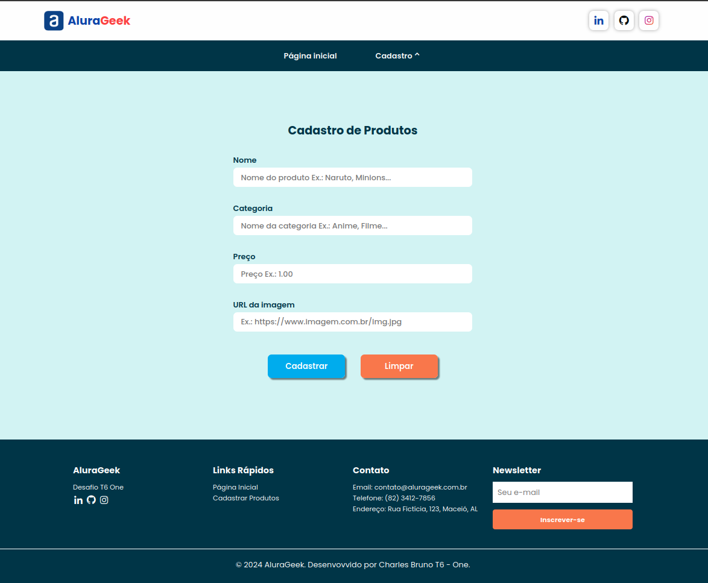
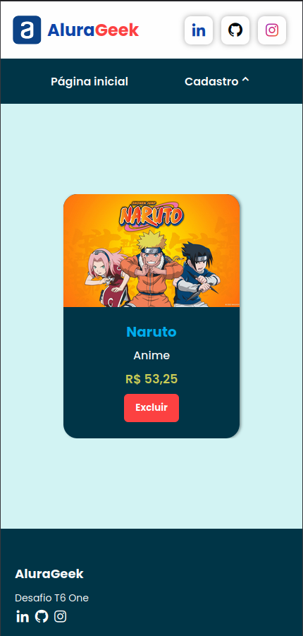
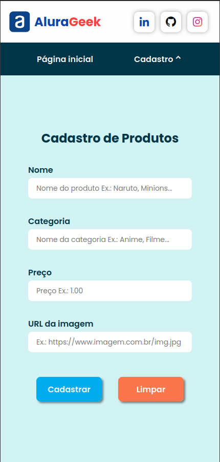

# AluraGeek

AluraGeek é um projeto focado em um sistema de cadastro de produtos em formato de cards. Este repositório contém o código fonte e as instruções necessárias para executar o projeto localmente, bem como os links para acessar o deploy online.
Funcionalidades

## :dizzy: Tecnologias utilizadas

<div>
  
  
  
  
  
  
  
  
</div>

## :computer: Estrutura do projeto

### O projeto é dividido em duas telas principais:

1. Tela Inicial: Exibe os produtos cadastrados em formatos de cartão.
2. Tela de Cadastro: Utiliza um menu dropdown para a construção do menu de cadastro e dentro deste, um submenu para produtos.

## :hammer: Funcionalidades

- `Inserção`: insere novos produtos.
- `validação`: valida campos ínvalidos.
- `Exclusão`: exclue produtos cadastrados.

### Interface da página inicial: 


### Interface de cadastro de produtos: 


<br />

### Interface do Usuário Responsiva:

<div style="display: flex; justify-content: flex-start; gap: 90px;"> 
   <div>
      <h4>Página inicial</h4>
      
   </div>
   <div>
      <h4>Cadastro de produtos</h4>
      
   </div>
</div>

## :dizzy: Como Acessar o Deploy Online

### Vercel

O projeto está disponível na Vercel. Você pode acessá-lo através do seguinte link: 

[AluraGeek na Vercel.](https://desafio-t6-one-alura-geek.vercel.app/)

### GitHub Pages

Alternativamente, você pode acessar o projeto através do GitHub Pages:

[AluraGeek no GitHub Pages.](https://charlesbrcosta.github.io/Desafio-T6-One-AluraGeek/)

## :memo: Observação

Caso você pretenda utilizar o projeto no seu computador local, será necessário alterar o link no atributo `apiUrl` do arquivo `connectionApi` para `http://localhost:3000/cards` no . Este arquivo está localizado: `js/connectionApi.js`

## :warning: Como Executar o Projeto Localmente usando o node

### Pré-requisitos

- Node.js instalado
- npm (gerenciador de pacotes do Node.js)
- Navegador web moderno que suporte HTML5, CSS3 e JavaScript.

## :dvd: Passo a Passo

1. Clone o repositório:

   ```bash
   git clone https://github.com/charlesbrcosta/Desafio-T6-One-AluraGeek.git

2. Acesse o diretório do projeto:
    ```bash
    cd Desafio-T6-One-AluraGeek

3. Instale as dependências:
    ```bash
    npm install ou npm i

4. Inicie o json-server:
    ```bash
    npm run start ou npm start

5. Acesse o projeto no navegador:
    ```bash
    http://localhost:3000/cards

## :warning: Como Executar o Projeto Localmente sem o node

### Pré-requisitos

- Navegador de internet
- json-server instalado

## :dvd: Passo a Passo

1. Clone o repositório:
   ```bash
   git clone https://github.com/charlesbrcosta/Desafio-T6-One-AluraGeek.git

2. Abra o terminal do Windows ou Linux

3. No Windows:

4. Navegue até o diretório do projeto:
    ```bash
    cd Desafio-T6-One-AluraGeek

- Abra o terminal do windows ou vscode e digite o comando na raiz do projeto:
    ```bash
    json-server --watch db.json

- Abra o arquivo index.html no navegador:
    ```bash
    start index.html

5. No Linux

- Abra o terminal do linux ou vscode e digite o comando na raiz do projeto:
    ```bash
    json-server --watch db.json

- Navegue até o diretório do projeto:
    ```bash
    cd Desafio-T6-One-AluraGeek

- Abra o arquivo index.html no navegador:
    ```bash 
    xdg-open index.html

## :handshake: Contribuição

Se você quiser contribuir com o projeto, siga os passos abaixo:

    Faça um fork deste repositório.
    Crie uma nova branch (git checkout -b feature/nova-feature).
    Faça commit das suas alterações (git commit -am 'Adiciona nova feature').
    Faça push para a branch (git push origin feature/nova-feature).
    Abra um Pull Request.

## :student: Autor

[<br><sub>Charles Bruno</sub>](https://github.com/charlesbrcosta)


## :page_facing_up: Licença

Este projeto está licenciado sob a [Licença MIT](https://www.mit.edu/~amini/LICENSE.md).
